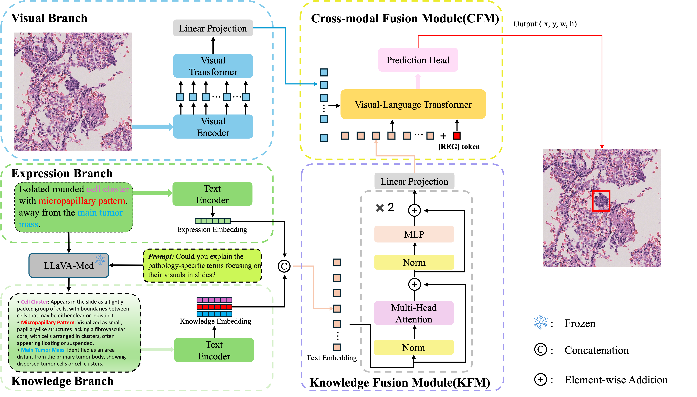

<h1 align="center">PathVG: A New Benchmark and Dataset for Pathology Visual Grounding</h1>

<div align='center'>
    <a href='' target='_blank'><strong>Chunlin Zhong</strong></a><sup> 1⋆</sup>,&thinsp;
    <a href='' target='_blank'><strong>Shuang Hao</strong></a><sup> 1⋆</sup>,&thinsp;
    <a href='' target='_blank'><strong>Junhua Wu</strong></a><sup> 2⋆</sup>,&thinsp;
    <a href='' target='_blank'><strong>Xiaona Chang</strong></a><sup> 2⋆</sup>,&thinsp;
    <a href='' target='_blank'><strong>Jiwei Jiang</strong></a><sup> 1</sup>,&thinsp;
    <a href='' target='_blank'><strong>Xiu Nie</strong></a><sup> 2✉</sup>,&thinsp;
    <a href='' target='_blank'><strong>He Tang</strong></a><sup> 1✉</sup>,&thinsp;
    <a href='' target='_blank'><strong>Xiang Bai</strong></a><sup> 1</sup>
</div>

<div align='center'>
    <sup>1 </sup>School of Software Engineering,
    Huazhong University of Science and Technology,
    Wuhan 430074, China&ensp;<br>
    <sup>2 </sup>Department of Pathology, Union Hospital,
    Tongji Medical College, Huazhong University of Science and Technology,
    Wuhan 430022, China
</div>

<div align="center" style="display: flex; justify-content: center; flex-wrap: wrap; margin: 20px 0;">
  <a href='https://link.springer.com/chapter/10.1007/978-3-032-05169-1_44'></a>&ensp;
  <a href='https://huggingface.co/datasets/fengluo/RefPath'></a>&ensp;
  <a href='LICENSE'></a>&ensp;
</div>

This repo is the official implementation of "[**PathVG: A New Benchmark and Dataset for Pathology Visual Grounding**](https://arxiv.org/abs/2502.20869)" (___MICCAI 2025___).

We introduce **RefPath**, a large-scale pathology visual grounding dataset containing 27,610 pathology images with 33,500 expert-verified language-grounded bounding boxes.

**Contact:** clzhong@hust.edu.cn; hetang@hust.edu.cn

## 📅 Updates (Timeline & To-Do)
Track key project milestones and resource releases below. Click the links to access corresponding resources once available:  
- [x] **2025-06-25**: Repository initialization (basic structure & README released)  
- [x] **2025-09-30**: PathVG Dataset public release → [Download Dataset](https://huggingface.co/datasets/fengluo/RefPath)   
- [x] **2025-12**: Full training/test code public release →  (link will be activated on release date)  
- [x] **2025-12**: Pre-trained model weights public release → [Weights Release] (link will be activated on release date)  

🔧 Environment Setup
Prerequisites
Our PathVG model is built on [TransCP](https://github.com/WayneTomas/TransCP), Please first follow TransCP's official environment configuration guide.  

## 📸 Overview

<div align="center">
  <!-- 替换为转换后的图片文件 -->
  
</div>

## Install

```shell
git clone https://github.com/WayneTomas/TransCP.git
conda create -n pytorch1.7 python=3.6.13
conda activate pytorch1.7
pip install -r requirements.txt
```
## 📊 Dataset Preparation (RefPath)

The **RefPath** dataset is publicly available on Hugging Face:  
<a href="https://huggingface.co/datasets/fengluo/RefPath"></a>

### Step 1: Download the dataset

The dataset consists of:
- `train.jsonl`, `testA.jsonl`, `testB.jsonl` annotation files
- Corresponding pathology images (provided as parquet files or individual images depending on the split)
- 
### Step 2: Organize the downloaded files
After downloading, we recommend organizing the data as follows:
```plaintext
RefPath/
├── train.jsonl
├── validation.jsonl
├── test.jsonl
└── images/                 # Extracted images from parquet files or directly downloaded
    ├── xxx.jpg
    ├── yyy.jpg
    └── ...
```

### Step 3: Convert to training format
The training and evaluation code requires pre-processed data files (.pth format) for efficient loading.
We have provided conversion scripts in the repository:

json2pt.py

```shell
python jsonl2pth.py \
  --input_jsonl ./data/RefPath/testB.jsonl \
  --output_pth ./PathVG/split/data/pathology2/testB.pth \
  --image_base ./data/RefPath/refpath_images
```

## Train

The following is an example of model training on the RefPath dataset.
```shell
python -m torch.distributed.launch --nproc_per_node=2 --master_port=29516 train.py --config configs/TransCP_R50_pathology2.py
```
## Eval

```shell
python -m torch.distributed.launch --nproc_per_node=2 --master_port=29516 eval.py \
    --config configs/TransCP_R50_pathology2.py \
    --test_split testB \
    --resume /path/to/your/checkpoint.pth
```
### Parameter Notes
- `--test_split`: Specifies the dataset split for evaluation. `testA` corresponds to 40X magnification pathology images, `testB` corresponds to 20X magnification pathology images, and `val` includes all test images for comprehensive evaluation.
- `--resume`: Path to the pre-trained model checkpoint (`.pth` file). This parameter is mandatory to load the trained model weights for inference.
- `--nproc_per_node`: Number of GPUs used for distributed evaluation (set to `2` in the example, adjust based on available GPUs).
- `--master_port`: Port for distributed communication (avoid port conflicts by changing to an unused port like `29517` if needed).


## 📝 Citation
If you use the PathVG dataset, code, or results in your research, please cite our MICCAI 2025 paper:<br>
@InProceedings{ ZhoChu_PathVG_MICCAI2025,<br>
                 author = { Zhong, Chunlin AND Hao, Shuang AND Wu, Junhua AND Chang, Xiaona AND Jiang, Jiwei AND Nie, Xiu AND Tang, He AND Bai, Xiang },<br>
                 title = { { PathVG: A New Benchmark and Dataset for Pathology Visual Grounding } }, <br>
                 booktitle = {Medical Image Computing and Computer Assisted Intervention -- MICCAI 2025},<br>
                 year = {2025},<br>
                 publisher = {Springer Nature Switzerland},<br>
                 volume = { LNCS 15972 },<br>
                 month = {October},<br>
                 pages = { 454 -- 463 },<br>
              }<br>

For questions or issues, please open an issue or contact the corresponding author at: [hetang@hust.edu.cn]
